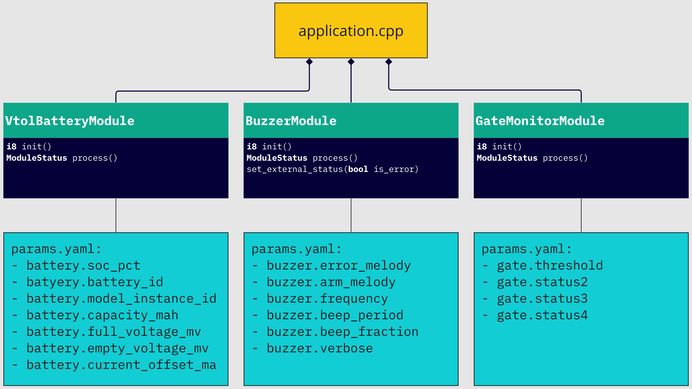

# VTOL PMU DroneCAN application

> Developers docs: [DroneCAN template application](https://github.com/RaccoonlabDev/mini_v2_node/wiki/dronecan).

### 1. Key features

- You can run the software in SITL mode (don't need to have any hardware),

### 2. Brief hardware info

| View | STM32CubeMX | Pinout |
| ---- | ----------- | ------ |
|  |  | pinout |

### 3. Application description

The PMU node do 3 things:
1. Battery. This module measures ADC voltage and current and estimates the battery state.
2. Gate monitor. This module measures gates voltages and estimates the corectness of the PMU and publishes the LogMessage if error is detected.
3. Buzzer. This module notifies with sound about such events as dead gates or arming state of the vehicle

From the software side, the high level node design can be illustrated with the following UML diagramm: 



More details about each module:

1. Battery sends [BatteryInfo](https://dronecan.github.io/Specification/7._List_of_standard_data_types/#batteryinfo) message with 1 Hz rate.


2. Gate monitor checks the gates

| DMA Rank | Periphery   | Pin  | Meaning        | Note |
| -------- | ----------- | ---- | -------------- | ---- |
| 1 | ADC_IN2 | PA2 | ADC_GATE_2 | If voltage < 1.4 V, so it is broken. |
| 3 | ADC_IN4 | PA4 | ADC_GATE_3 | If voltage < 1.4 V, so it is broken. |
| 4 | ADC_IN6 | PA6 | ADC_GATE_4 | If voltage < 1.4 V, so it is broken. |

If at least one gate is broken, it starts to notify with LogMessage each 10 seconds until the node is rebooted. The LogMessage has a number of broken gates.

The node ignores all broken states first 5 seconds to prevent false positive failures.

3. Buzzer notifies with sound about dead gates or arming state

> arming state will appear later...

### 4. How to upload a firmware?


### 5. Notes

**Current ADC**

1. Accuracy

```
ADC_RESOLUTION = 12 bit
ADC_RAW_MAX = 4095
MAX_CURRENT = 600 A
CURRENT_SENSETIVITY = 146.5 mA
```

2. Frequency

```
MCU_FREQUENCY = 72 000 000
ADC_FREQUENCY = 12 000 000
NUMBER_OF_CONVERSION = 7
SAMPLING_TIME = 55.5 Cycles
THEORY_GROUP_FREQUENCY = 30 888 Measurements/sec
ACTUATL_GROUP_FREQUENCY = 22 175 Measurements/sec
```
