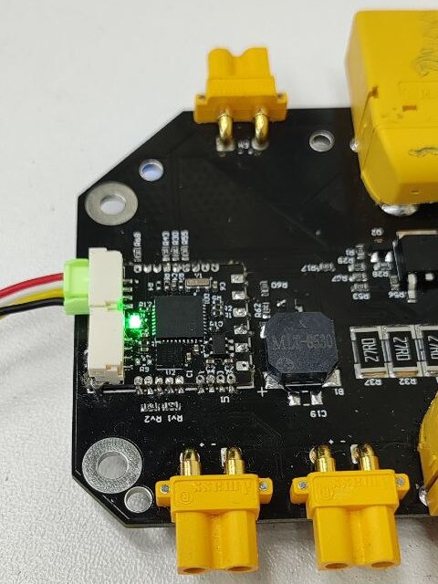

[](https://sonarcloud.io/summary/new_code?id=Innopolis-UAV-Team_vtol_pmu_node) [](https://sonarcloud.io/summary/new_code?id=Innopolis-UAV-Team_vtol_pmu_node) [](https://github.com/Innopolis-UAV-Team/vtol_pmu_node/actions/workflows/dronecan.yml)

# VTOL PMU DroneCAN application

> Developers docs: [DroneCAN template application](https://github.com/RaccoonlabDev/mini_v2_node/wiki/DroneCAN-application).

### 1. BRIEF HARDWARE INFO

| View | STM32CubeMX | Pinout |
| ---- | ----------- | ------ |
|  |  | pinout |

### 2. APPLICATION DESCRIPTION AND DESIGN

The PMU node does 3 things:
1. Battery. This module estimates the battery info based on ADC voltage and current measurements and publishes [BatteryInfo](https://dronecan.github.io/Specification/7._List_of_standard_data_types/#batteryinfo) message.
2. Gate monitor. This module estimates the internal state of the PMU based on ADC voltage of gates. It publishes the [LogMessage](https://dronecan.github.io/Specification/7._List_of_standard_data_types/#logmessage) and set `CRITICAL` state once an error is detected.
3. Buzzer. This module notifies with sound if the internal state of the board is bad. If the internal state is fine, it repeats the [BeepCommand](https://dronecan.github.io/Specification/7._List_of_standard_data_types/#beepcommand) from an autopilot.

From the software side, the high level node design can be illustrated with the following UML diagramm: 


More details about each module:

#### 2.1. Battery

The battery module sends [BatteryInfo](https://dronecan.github.io/Specification/7._List_of_standard_data_types/#batteryinfo) message with 1 Hz rate.


Here:
- `voltage` and `current` are measured values,
- `full_charge_capacity_wh`, `battery_id`, `model_instance_id` are configured via parameters,
- `average_power_10_sec`, `remaining_capacity_wh`,`state_of_charge_pct` are calculated based on the above values.

#### 2.2. Gate monitor checks the gates

If at least one gate is broken, it starts to notify with LogMessage each 10 seconds until the node is rebooted. The LogMessage has a number of broken gates.

The node ignores all broken states first 5 seconds to prevent false positive failures.

| DMA Rank | Periphery   | Pin  | Meaning        | Note |
| -------- | ----------- | ---- | -------------- | ---- |
| 1 | ADC_IN2 | PA2 | ADC_GATE_2 | If voltage < 1.4 V, so it is broken. |
| 3 | ADC_IN4 | PA4 | ADC_GATE_3 | If voltage < 1.4 V, so it is broken. |
| 4 | ADC_IN6 | PA6 | ADC_GATE_4 | If voltage < 1.4 V, so it is broken. |

#### 2.3. Buzzer

The buzzer notifies with sound about dead gates.

### 3. PARAMETERS

Here is a list of parameters.


More details you can find in the parameters auto-generated documentation [Src/dronecan_application/README.md](Src/dronecan_application/README.md).

### 4. TEST CASES

#### 4.1. TestBatteryInfo

TC1. test_publish_rate

| ID | Description | Steps | Expected result |
|-|-|
| TC1 | test_publish_rate | 1. Obtain 3 BatteryInfo messages| Publish rate must be 1 Hz. If this test fails, skip all next tests |
| | | | 2. Compare timestamp differences with 1 sec | Timestamp differences is 1 sec, acceptable error is 50 ms |


TC3. test_current

| Description | The temperature should be adequate |
|-|-|
| Steps | 1. Obtain the current value </br> 2. Verify that the temperature is within the specified range |
| Expected result | The current value is within [0.0, 200.0] Amperes |

TC4. test_temperature

| Description | The temperature should be adequate |
|-|-|
| Steps | 1. Obtain the temperature value </br> 2. Verify that the temperature is within the specified range |
| Expected result | The temperature value is within [0.0, 200.0] Amperes |

TC5. test_soc_fixed

| Description | PMU has a feature to set a fixed SOC percentage |
|-|-|
| Precondition | 1. `battery.soc_pct` is randomly within [0, 100] |
| Steps | 1. Read `battery.soc_pct` </br> 2. Obtain 1 `BatteryInfo` message </br> 3. Compare `msg.state_of_charge_pct` with `battery.soc_pct` |
| Expected result | `msg.state_of_charge_pct` matches the random value set for `battery.soc_pct` |

TC6. test_battery_and_instance_id

| Description | Battery and isntance ID are used to diffentiate one battery to another |
|-|-|
| Precondition | 1. `battery.battery_id` is random value </br> 2. `battery.model_instance_id` is random value |
| Steps | 1. Read `battery.battery_id` </br> 2. Read `battery.model_instance_id` </br> 3. Compare read values |

TC7. test_soc_auto

| Description | PMU is able to automatically estimate the remaining battery level |
|-|-|
| Precondition | 1. `battery.soc_pct=-1` </br> 2. `battery.empty_voltage_mv=4000` </br> 3. `battery.full_voltage_mv=5000` |
| Steps | 1. Obtain `BatteryInfo` </br> 2. Check SOC |
| Expected result | `msg.state_of_charge_pct` should correspond the `msg.voltage` using the formula |

TC8. test_remaining_capacity_wh

| Description | PMU is able to automatically estimate the remaining capacity |
|-|-|
| Precondition | 1. `battery.soc_pct=-1` </br> 2. `battery.empty_voltage_mv=4000` </br> 3. `battery.full_voltage_mv=5000` </br> 4. `battery.full_capacity_wh` is random |
| Steps | 1. Obtain `BatteryInfo` </br> 2. Check `msg.remaining_capacity_wh` |
| Expected result | `msg.full_capacity_wh` should correspond the `msg.voltage` using the formula |

#### 4.2. TestBuzzer

- I don't know how to automatically test it...

#### 4.3. TestGateMonitor

- TC1. Test good gate
  Reboot the node.
  Set `gate.threshold` to 4095 (that means gates are always ok).
  Wait for 15 seconds.
  Debug message should not appear.
  The NodeStatus should have good health.
- TC2. Test bad gates
  Reboot the node.
  Set `gate.threshold` to 0 (that means gates are always bad).
  Verify, that the node publish LogMessage with 0.1 Hz rate (burst publishing are not allowed, first 5 second node publish nothing)
  The NodeStatus should have CRITICAL health.

### 5. CONNECTION

| SWD connector </br> Upload a firmware | JST GH 4 pin connector </br> CAN-bus bench test |
|-|-|
|  |  |

### 6. NOTES

**Current ADC**

1. Accuracy

```
ADC_RESOLUTION = 12 bit
ADC_RAW_MAX = 4095
MAX_CURRENT = 600 A
CURRENT_SENSETIVITY = 146.5 mA
```

2. Frequency

```
MCU_FREQUENCY = 72 000 000
ADC_FREQUENCY = 12 000 000
NUMBER_OF_CONVERSION = 7
SAMPLING_TIME = 55.5 Cycles
THEORY_GROUP_FREQUENCY = 30 888 Measurements/sec
ACTUATL_GROUP_FREQUENCY = 22 175 Measurements/sec
```
