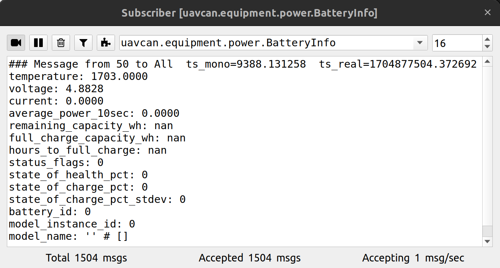
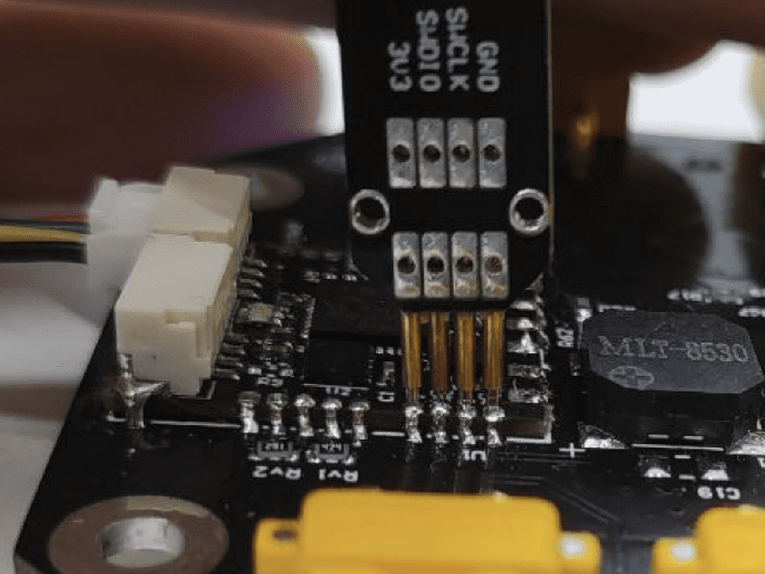

# VTOL PMU DroneCAN application

> Developers docs: [DroneCAN template application](https://github.com/RaccoonlabDev/mini_v2_node/wiki/dronecan).

### 1. Key features

- You can run the software in SITL mode (don't need to have any hardware),

### 2. Brief hardware info

| View | STM32CubeMX | Pinout |
| ---- | ----------- | ------ |
|  |  | pinout |

### 3. Application interface

[BatteryInfo](https://dronecan.github.io/Specification/7._List_of_standard_data_types/#batteryinfo)



### 4. How to upload a firmware?



### 5. Notes

**Current ADC**

1. Accuracy

```
ADC_RESOLUTION = 12 bit
ADC_RAW_MAX = 4095
MAX_CURRENT = 600 A
CURRENT_SENSETIVITY = 146.5 mA
```

2. Frequency

```
MCU_FREQUENCY = 72 000 000
ADC_FREQUENCY = 12 000 000
NUMBER_OF_CONVERSION = 7
SAMPLING_TIME = 55.5 Cycles
THEORY_GROUP_FREQUENCY = 30 888 Measurements/sec
ACTUATL_GROUP_FREQUENCY = 22 175 Measurements/sec
```
