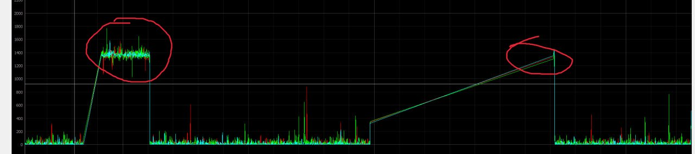

The node has the following registers:

| №  | Register name           | Description |
| -- | ----------------------- | ----------- |
|  1 | uavcan.node.id          | Defines a node-ID. Allowed values [0,127]. |
|  2 | system.name             | Defines custom node name. If empty, the node will use 'arl.pmu' name. |
|  3 | battery.soc_pct         | Percent of the full charge [-1, 127]:   - Value of -1 means auto estimation (doesn't work at the moment),   - [0, 100] means constant percent,   - [101, 127] means constants as well, but the values are incorrect for an autopilot. |
|  4 | battery.battery_id      | Value of battery_id field in BatteryInfo message |
|  5 | battery.model_instance_id | Value of model_instance_id field in BatteryInfo message |
|  6 | battery.capacity_mah    | Full battery capacity, mAh. Default is 20000 mAh. We have 4 [Tattu 10000 mAh 6S Lipo Battery](https://genstattu.com/tattu-plus-22-2v-25c-6s-liPo-battery-10000-mah-with-as150-xt150-plug.html) (2 in parallel, 2 in seies). |
|  7 | battery.full_voltage_mv | Full battery voltage, mV. |
|  8 | battery.empty_voltage_mv | Full battery voltage, mV. |
|  9 | buzzer.error_melody     | Melody that is played during error:   - 0 means anoying beep melody (500 ms enabled, 500 disabled), - 1 means tolerable melody (500 ms enabled, 2500 ms disabled)  - 2 means bimmer melody  - [3, 126] - reserved, no melody  - 127 constant sound defined by buzzer.frequency and buzzer.duration. |
|  10 | buzzer.arm_melody       | Melody that is played when the vehicle is armed. Not implemented at the momement. |
|  11 | buzzer.frequency        | This parameter is applied only if buzzer.melody=127. It means PWM Frequency, Hz. |
|  12 | buzzer.beep_period      | This parameter is applied only if buzzer.melody=127. It means sound duration in us. |
|  13 | buzzer.beep_fraction    | This parameter is applied only if buzzer.melody=127. It means fraction of bell ringing over beep_period in %. |
|  14 | buzzer.verbose          | Indicates the operational mode of the node. When set to 1, the uavcan.equipment.indication.BeepCommand will be transmitted, including the current Buzzer frequency and duration. |
|  15 | gate.threshold          | If gate ADC less than this parameter, so it is broken. If the node detects a broken gate once, it publishes LogMessage every 10 seconds until reboot. 
 |
|  16 | gate.status2            | Gate 2 raw ADC value |
|  17 | gate.status3            | Gate 3 raw ADC value |
|  18 | gate.status4            | Gate 4 raw ADC value |

> This docs was automatically generated. Do not edit it manually.

